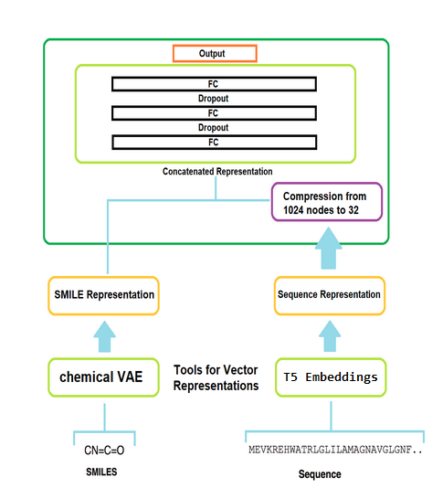

# Prediction-Of-Binding-Affinity

* [Description](#Description)
* [Setup](#Setup)
	* [BindingDB](#BindingDB)
* [Usage](#usage)
	* [Preprocess Data](#Preprocess-Data)
	* [Training a model](#Training-a-model)
		* [config.ini](#config.ini)
	* [Load pre-trained model and load new data](#Load-pre-trained-model-and-load-new-data)
* [Links](#Links)
	* [Project related presentations and publications](#Project-related-presentations-and-publications)
	* [Related resources](#Related-resources)
		* [Embeddings](#Embeddings)
		* [Databases](#Databases)
		* [Related Work](#Related-work)
* [ToDOs](#ToDOs)
* [Future ideas](#Future-ideas)
